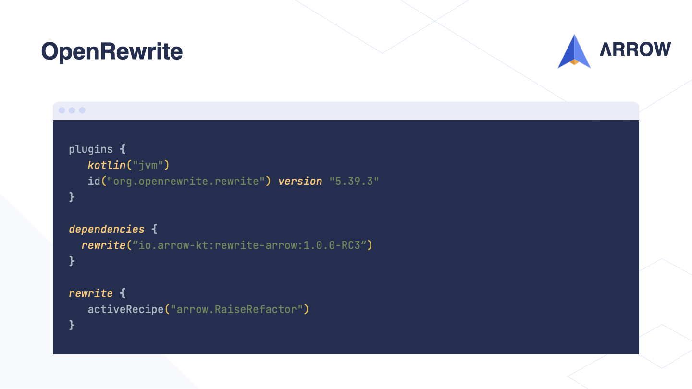

This blog post is an improved version of the transcription of the presentation I gave at KotlinConf 2023.
It discusses the 10-year history of [Arrow](https://arrow-kt.io), all the way from the first commit to the current state of the library.
It also discusses the future of Functional Programming in [Kotlin](https://kotlinlang.org), and the challenges OSS projects face.

---

Good morning everyone,

I hope you all had a great trip to Amsterdam and are well-rested for this exciting conference.
I am thrilled to be here today to discuss Kotlin, Open-Source, and Functional Programming.

Thank you all for coming to my talk about Arrow's trajectory towards 2.0.

Before we dive into the main topic, let me briefly introduce myself. My name is Simon.

---

I have been working with Kotlin for the past eight years, since 2015, and I am a fanatic open-source developer.

Mostly active on GitHub and over the past five years, my primary focus has been on Arrow, but I also contribute to other projects and organisations.

Currently, I work as a Principal Engineer at [Xebia Functional](https://www.47deg.com), previously known as 47 Degrees.

My favorite place to engage with the community is the [Kotlin Slack](https://slack-chats.kotlinlang.org/c/arrow), but you can also find me on [Mastodon](https://fosstodon.org/@vergauwen_simon) and [Twitter](https://twitter.com/vergauwen_simon). I exclusively discuss Kotlin, with a focus on Arrow and back-end related topics.

---

During this talk, I plan to cover five topics.
Firstly, I will shed light on the history of Arrow and the reasoning behind some decisions made in the past. As we dive into this topic, I will also discuss the complexity of functional programming from a Kotlin perspective. While these opinions are my own, I believe they are shared by many in the Kotlin and Arrow community.

Next, I will share my thoughts on the importance of embracing the language and the ecosystem. A uniform and cohesive ecosystem of libraries that work well together is crucial not only for productivity and collaboration within the community, but also for the success of the language.

In addition, I will discuss one of the hardest aspects of open-source software - evolving APIs and libraries. While it can be frustrating and expensive to break code, sometimes it's necessary in the path towards success.

Lastly, I will mention other projects in the ecosystem and highlight the community in and around Arrow.

---

To understand the history of Arrow, we need to take a big jump back to a time before Kotlin was on my radar. In 2013, Mario Arias created funKtionale. Developers working in Scala with Spring wanted to use Kotlin's seamless interoperability with Java. However, they quickly realized that Kotlin lacked a set of features they had grown used to in Scala. This led to the creation of funKtionale, which aimed to solve this problem.

Fast-forward to 2017, a Spanish community named FineCinnamon created a learning project called Katz, heavily inspired by the Typelevel ecosystem in Scala. However, it quickly evolved and changed its name to Kategory to become its own entity as it grew larger over time.

Around the same time, I was also on a learning adventure and created Optikal, an Optics library in Kotlin inspired by Monocle from Scala. After I made the project public, the Kategory maintainers approached me and invited me to the Lambda World conference, where they asked me to join the Kategory efforts. Excited by the opportunity to join forces, I agreed.

Soon after, Mario from funKtionale joined us, and we all merged our efforts to prevent conflicting libraries in the community. To avoid imposing a name, we created a new open-source organization called Arrow.

Arrow's goal is to facilitate **uniform and idiomatic** functional programming **for everyone** in Kotlin, preventing fragmentation and competing libraries.

---

All of this happened during what I refer to as the pre-0.12.x era, which heavily relied on Typeclasses and Higher Kinded Types - two features that don't exist in Kotlin but are available in Scala.

While I don't want to delve too deeply into these technical concepts, I would like to briefly show how they were used in Arrow pre-0.12.x to give you an idea of how far we've come.

---

It's clear that in the early days, Arrow code looked quite foreign to many Kotlin developers, especially those coming from a Java background where these features didn't exist.

It's worth noting that Kotlin's Structured Concurrency didn't exist at the time either.

The heavy use of generics and the `Kind` type to emulate Higher Kinded Types made the code look and feel non-idiomatic. The concept of Higher Kinded Types and the `F` generic leaked everywhere, as shown in the example of the `ListK` wrapper used to wrap a Kotlin `List`.

All of this complexity made it challenging for developers to work with these abstractions, particularly since Kotlin didn't natively support this functionality and relied on tricks and hacks to make it work.

---

In this code snippet, we can observe how the `GistsApi` is used with `Mono` type from Project Reactor.

However, due to the `F` abstraction and Higher Kinded Types, we have to use the `fix` method to "fix" the Higher Kinded representation to access the resulting `mono` value, and finally we can call the code…

---

So, what's the point of all this `F` and Higher Kinded Type complexity?

`F` is often used to write code that is independent of the runtime or framework being used. This allows for higher-level, more abstract code that doesn't make any assumptions about the _effect_ being used.

However, achieving this level of abstraction required a lot of complexity and obscurity. We had to use tricks and hacks like `Kind` and `ListK` to work around Kotlin's lack of support for Higher Kinded Types.
Fortunately, this is now a thing of the past.

With the introduction of KotlinX Structured Concurrency in September 2018, we no longer need to rely on these abstractions to the same extent.
It's a big step forward that has made our code simpler and easier to understand. But it's important to remember where we came from and appreciate the progress we've made.

---

Around 2018-2019, with the announcement and release of Structured Concurrency, we decided to move away from our previous approach and look for new solutions. This led to an overhaul of Arrow, and marked a major milestone with the release of versions 0.12.x and 0.13.x.

In version 0.12.x, we deprecated the use of Higher Kinded Types and Typeclasses, which had powered the machinery in our earlier code examples.

With the release of version 0.13.x, we completely removed these features, and as a result, we were able to support Kotlin Multiplatform in Arrow. This was a significant step forward and demonstrated the benefits of simplifying our code and aligning more closely with the idioms of the language.

---

In summary, using Arrow for functional programming in Kotlin originally presented a steep learning curve. It required familiarity with the programming style used in Scala or Haskell, resulting in non-idiomatic code that was difficult to comprehend and explain. This also caused friction with IDEA and other tooling at the time.

Moreover, Arrow's approach attempted to emulate concepts that were not available in Kotlin, leading to a foreign and complex development experience. This went against one of Arrow's primary goals: to provide functional programming that is idiomatic and accessible to everyone using Kotlin.

Fortunately, with the popularity of KotlinX Structured Concurrency and Kotlin Coroutines, we sought a solution that seamlessly integrates these technologies with Arrow without compromising any of its features. In the following sections, we will explore how we have achieved this, eliminating complexity and delivering a more elegant and intuitive experience for developers.

---

In this updated definition of our `GistsApi`, you will notice that all references to `F` have disappeared, and we have eliminated our custom `ListK` wrapper as well. Now, everything looks like common Kotlin code, and there is no trace of Arrow anymore.

This is because we can leverage the suspend keyword, which takes care of everything that we need, and with the power of Coroutines, we can seamlessly compose or mix-and-match different functional concepts, as we will see shortly.

---

As you can see, we have achieved the same goal as before, but in a much simpler way. With a single `GistsApi`, we can use it in combination with many runtimes such as Project Reactor, ReactiveX or JDK8 Futures.

Furthermore, building an integration layer with any framework or runtime environment that you need to work with is quite easy and straightforward.

---

In the 1.x series of Arrow, we continued to prioritize making the library more Kotlin idiomatic. Building on the success of Structured Concurrency and coroutines, we went all-in on using suspend and domain-specific languages (DSLs).

One challenge with functional APIs is that they often have complex names and signatures, and FP libraries tend to have a large API surface to allow composing all different shapes of functions. This can be overwhelming for developers, as we experienced with Arrow in Kotlin.

To address this, we gathered feedback from the community and through frequently asked question we were able to truly pinpoint the pain points of Arrow. We focused on adopting a DSL-style approach to functional programming, using more idiomatic names and addressing these common pain points.

---

This Kotlin code using [`Either`](https://apidocs.arrow-kt.io/arrow-core/arrow.core/-either/index.html) might look familiar if you've worked with functional programming languages before.
We use `Either` to handle processing a `GithubUser`, which can result in either a `ProcessingFailed` error or a `ProcessedUser`. To wrap these values in the `Either` container, we use the `left` and `right` constructors.

While this approach is perfectly valid, we believe we can make the code even more idiomatic and readable by using DSLs and other Kotlin language features.

---

In its DSL form, the same function can be simplified using the `eager` function to open the DSL block.
In the 1.x.x series, we still need to distinguish between suspending and non-suspending DSLs using `eager`.
And we use the `ensure` DSL to check a predicate. If the predicate is not matched, it raises the typed error of `ProcessingFailed`.
The `ensure` function works similarly to the Kotlin Std require method, but for typed errors instead of exceptions.

With the DSL, we no longer need to explicitly wrap our results in `left` or `right`.
This is automatically taken care of by the DSL. This same syntax is available for all types in Arrow and can be easily leveraged for your own types.

Interestingly, we can also leverage this same DSL to remove all wrappers altogether, as we'll see later.
But first, let's take a look at another example where this pattern is used to simplify APIs.

---

In functional programming, transforming every element of a `List` using `Either`, or a different data type, is typically done using `traverse`. Although it is an easy concept to learn, many people still find it challenging to use. This is why the joke "the answer is always traverse" is often mentioned, implying that developers forget to use traverse when it's needed.

The reason behind this is that we usually associate transforming every element of a `List` with the `map` function. While every Kotlin developer is familiar with `map`, we can't use it to transform every element of a `List` to an `Either` since we need an `Either` containing a `List`. Hence, we need to use `traverse` to flip the order of the containers.

---

In a DSL style, we no longer need to use `traverse` to transform every element of a `List` using `Either` or another data type.
Instead, we can simply use `map` and other standard collection operators.
In the DSL style, we "unwrap" the `Either` by using `bind`.
This approach works for any data type in Arrow or any custom data type you've built a DSL for using Arrow.

By using the APIs that we're all already familiar with from the Kotlin Std and reducing the API surface of Arrow, we've significantly reduced the learning curve of doing FP in Kotlin with Arrow.
This makes it much more user-friendly and less confusing to figure out which API to use.

---

We are excited to announce the release of version 1.2.0-RC, which includes the complete API for Arrow 2.0.
This release marks a significant milestone as Arrow 2.0 has been able to shed some of its legacy, obscure, and complex APIs inherited from pre-0.12 era.
The new version is expected to be released later this year, possibly alongside Kotlin 2.0.

The Arrow 2.0 series boasts a small and uniform API that covers all use-cases from the very beginning, with a greatly reduced learning curve.
This makes it much easier for developers to learn and use Arrow. Let's take a look at some final examples!

---

This snippet is very similar to the previous one, but with one key difference: it no longer requires the `eager` function.
We no longer have to distinguish between suspending and non-suspending DSLs.

Thanks to Kotlin's support for DSLs, Arrow DSL functions now have a special color, making them easier to spot and read.

We're also using Kotlin Contracts in more places to take advantage of the Kotlin compiler's specialized support.
For instance, we're using `ensureNotNull`, which is similar to `requireNotNull` from the Kotlin Standard Library, to check a value and smart-cast it to non-null once it's been verified.

All these features allow Arrow to provide the same semantics you'd expect from functions in the Kotlin Standard Library, making it feel more idiomatic and natural.

---

API naming can be a challenging task, and while languages like Haskell have valid reasons to use more obscure API names, this is not the case in Kotlin. 
This has been especially true since post-0.12.0.

Therefore, we have chosen to follow the conventions of the Kotlin Standard Library for our API naming.
In fact, all the names you see here were inspired by Kotlin's `Result` type.
This approach should make the names feel right at home and familiar to anyone who is already accustomed to the Kotlin Std library.

---

One of the most exciting features of Arrow's functional programming in Kotlin is the use of context receivers, which I believe will be a major innovation and a significant quality-of-life improvement for Kotlin developers in general.

With context receivers, we can forget about wrapper types and instead define _co-effects_.
For example, instead of returning an `Either` of `ProcessingFailed` or a `ProcessedUser` when processing a `GithubUser`, we can add a context that can _raise_ a `ProcessingFailed` and simply return a `ProcessedUser`, without the need for an `Either` wrapper.

Furthermore, we can now access our DSL inside the method body without having to open a DSL block like we did before, as all DSLs in Arrow are built on top of the `Raise` type.

For example, when we need to `traverse` a collection and transform every element, we can simply use `map` without even requiring the use of `bind`. This is because processing our user now simply returns `ProcessedUser`.

---

This same DSL approach is applicable to many patterns.

Here are two small examples:

- One is for `Resource` safety, where we define an `acquire` and a `finalizer` action in a direct style.
- The other is the `Saga` pattern, where we define an `action` and a `compensating action` also in a direct style.

What is so interesting about these DSLs is that they all compose together without ever requiring nesting of wrappers or any special techniques to combine functionalities such as _Monad Transformers_.

---

I mentioned earlier that by reducing the API surface, we were able to decrease the binary size without compromising on features.
This had a drastic effect on the overall size of Arrow!

Before version 0.12.x, the binary size was slightly over 4,1MB. With the 1.0.0 release, we were able to reduce that to just over 3MB.
But with the latest 2.0 version, the binary size is now under 500KB!

This is a really significant improvement because it means that Arrow has a much smaller impact on the size of your projects or libraries.
With such a small API surface and binary size, it's now even easier to include Arrow in your projects without worrying about the size impact.

---

The evolution of Arrow over the past 10 years has demonstrated the importance of iterative API development.
Community feedback and interaction have been critical to this process, allowing us to build a stronger library together.

Learning a new language can be challenging, as you might have experienced.
While you can be productive in Kotlin within days, as we become more familiar with a language, new patterns and techniques emerge, sometimes requiring us to let go of old patterns learned in other languages. For example, the rise of Structured Concurrency led to the removal of Arrow’s `IO`, Higher Kinded Types, and Typeclasses.

While these changes are positive, they also come with a downside: breaking existing code.
This a burden I find very heavy to bear, and Arrow worked hard to mitigate the impact of these changes on our users.

---

The first and perhaps most obvious way to deal with API changes is through Kotlin's `Deprecated` annotation, which supports the `ReplaceWith` parameter.
This parameter enables a library to suggest a new alternative API.
For example, we can use it to recommend the use of the DSL-based `recover` method instead of the old `handleErrorWith` method.

---

When opening the action window in IntelliJ, the deprecated method will suggest automatically refactoring to the suggested alternative API specified in the `ReplaceWith` annotation, which can be applied to the entire project.
However, we have found that this approach doesn't cover all cases and may not always work as intended.
Additionally, it is not well documented and has some edge cases that need to be considered.

---

Another promising option for dealing with breaking changes is OpenRewrite, an open-source tool for large-scale automated refactorings developed by Moderne, a revolutionary automated code remediation platform.

Although Kotlin support in OpenRewrite is still experimental, I found it to be very promising and was among the first to use it extensively.
The community and maintainers were extremely friendly and helpful.

Let's take a closer look at how we can use OpenRewrite to refactor our codebase.

---

To set up OpenRewrite, we only need to configure a few things in Gradle.

Firstly, we need to add the OpenRewrite Gradle plugin to our project's plugin block.

Next, we add a dependency for the rewrite project, which contains the recipes that describe the various refactorings available.

Finally, we can activate specific recipes by including them in our Gradle configuration.
For example, we could activate the recipe for refactoring the `Raise` DSL.

---

We can then simply run the rewriteRun task from Gradle.

OpenRewrite will process our project and apply the recipes that we have activated.
After the task completes, OpenRewrite will list the processed files and which recipes have been applied to each of them.

---

OpenRewrite is a truly powerful tool that allows us to automate large-scale refactorings, making code maintenance and modernization a breeze.

While Kotlin support is still experimental, it's evolving rapidly, and any issues or bug reports are typically fixed within a day or two. This gives me great hope for the future of this tool.
It's currently only supported for the JVM and `commonMain` sourceSets, so the refactorings cannot be applied to JS and Native sourceSets at the moment.

At the moment, only one recipe has been finished, but more refactorings and improvements are being made. The aim is to ensure that no one will be left behind on older Arrow versions as the community moves towards 2.0.

---

Equally important to all these changes is having good documentation.
With this new version of Arrow, we have a brand new website that emphasizes use-cases and industry patterns instead of just explaining how things work.

The previous website and documentation were quite technical, but we have now re-oriented the documentation to better focus on how Arrow can be used and applied in your projects and applications.

---

The new Arrow website also provides an extensive migration guide that explains the reasoning behind all changes in detail, as well as what the expected new code should be and why.

This guide can be helpful if you need to do a manual migration or if OpenRewrite or IntelliJ's ReplaceWith is not working for your project.

---

At Arrow, we believe that functional programming should be accessible to everyone in Kotlin.
To make it easier for users to discover and learn about all the libraries that facilitate this, we've added a dedicated ecosystem page to the Arrow website.

We also want to encourage developers who are building functional libraries in Kotlin but aren't yet listed on the page to reach out to us.
By working together, we can create a vibrant community where users can easily find and use the best functional libraries available.

---

Before I conclude, I want to express my gratitude to the entire Arrow community.
To all the contributors who have dedicated their time and effort to make Arrow what it is today, to all the users who trust and utilize Arrow in their projects, and to everyone who provided feedback and supported us along the way.
Thank you all for your invaluable contributions and support.

---

We're very active on both Slack and GitHub, and you can find a large portion of the Arrow and functional programming community there.
I invite all of you to join us if you haven't already and come chat with us.

---

Before I wrap up, I'd like to extend my gratitude to Xebia Functional for their continuous support and sponsorship of Arrow throughout the years, and for building the new Arrow website.
If you visit their booth, you can get a discount coupon for Arrow and Kotlin courses provided by Xebia Functional.

Also, you can find me at the Arrow booth, next to the Xebia Functional booth.
I'll be there for the entire conference and would be more than happy to answer any questions you may have about Arrow, functional programming, or Kotlin.
I hope to see you there!

---

Thank you all for attending my talk today. I hope you found it informative and useful.
I also want to thank the organizers for putting together this fantastic conference and for giving me the opportunity to speak to all of you.

Before you leave, please remember to vote for your favorite talks and speakers. Your feedback helps us improve and deliver better content in the future.

And most importantly, I hope you have a great time at KotlinConf! Enjoy the rest of the sessions and have fun networking with other Kotlin enthusiasts. Thank you!

---